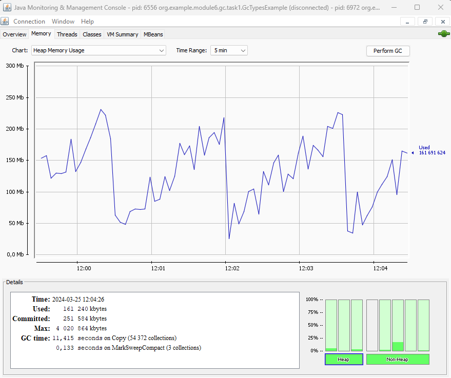
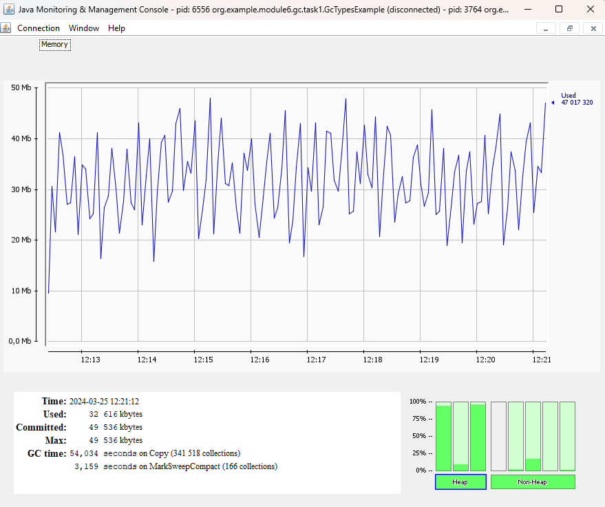
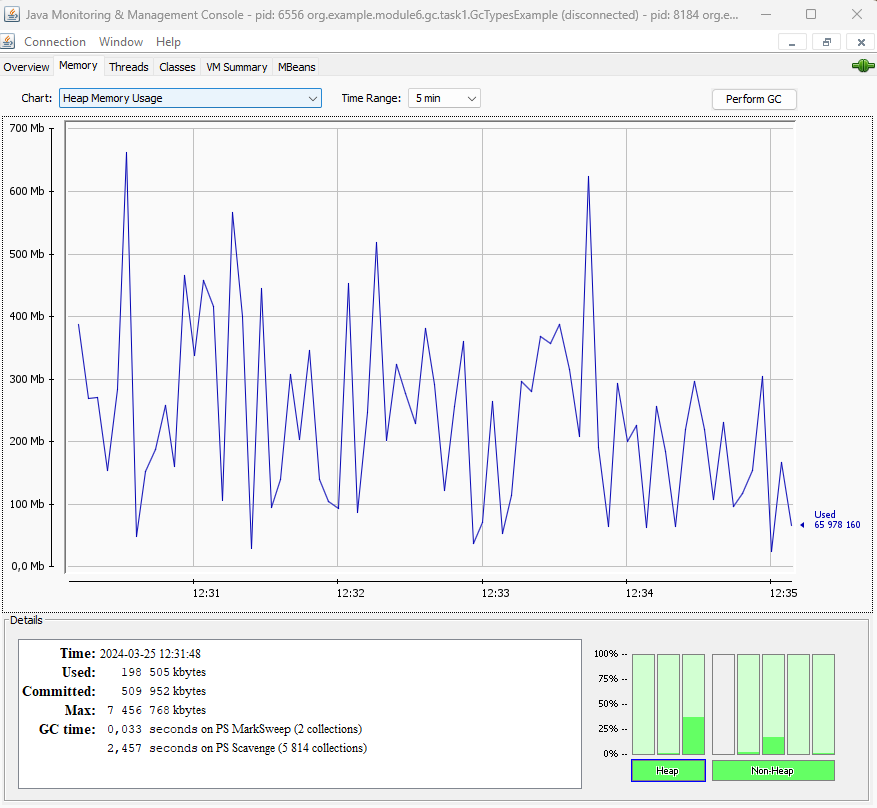
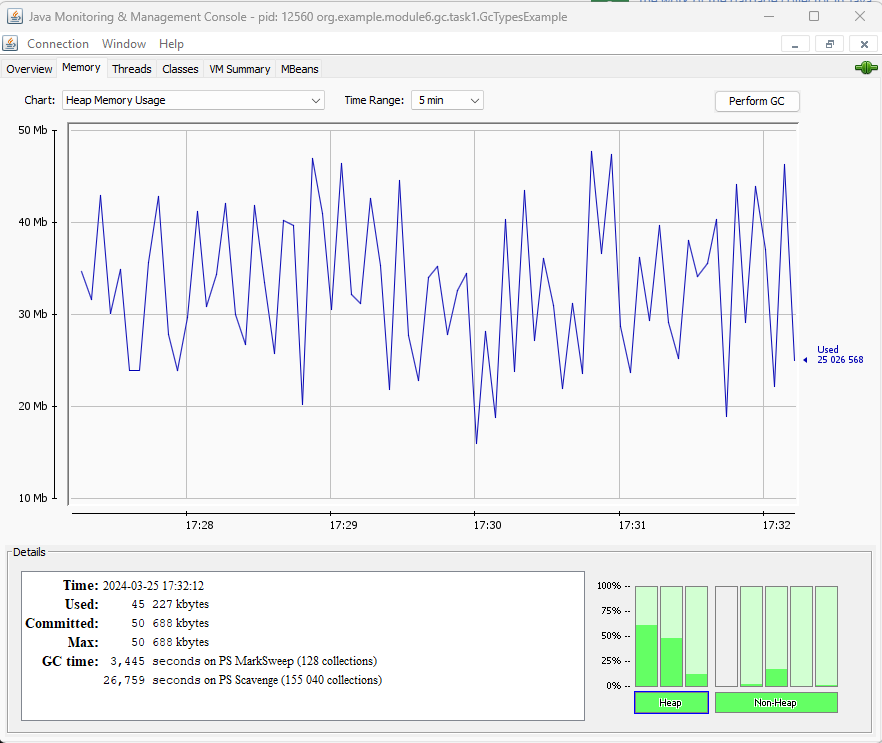
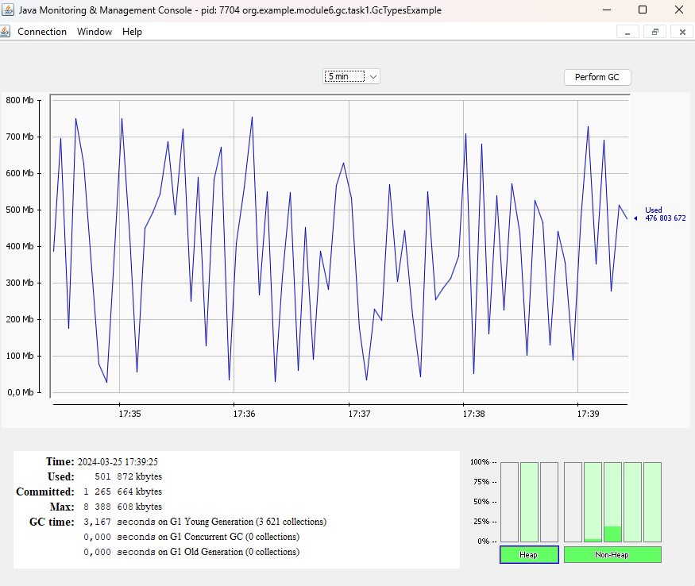
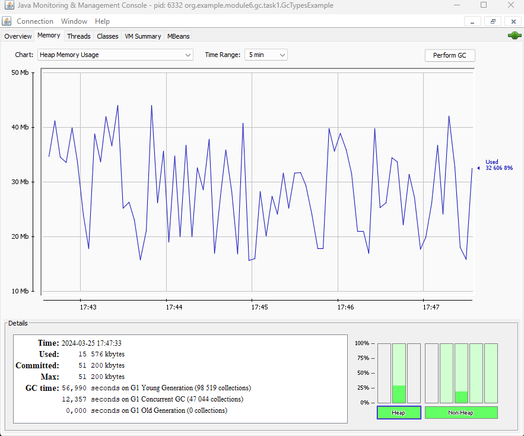

# Общая информация

Приложение создает много строк и тут же удаляет на них ссылки

На всех тестах приложение использовало только производительные ядра процессора, тротлинга не обнаружено

Команда запуска:
```java -XX:+UseSerialGC -Xmx8g -classpath C:\Users\mansur\Desktop\qwerty\mansur-on-protoware\target\classes org.example.module6.gc.task1.GcTypesExample```

# Тесты

## Serial

### Большая куча - 8 гигабайт

Сборщик мусора вызывает по несколько раз в секунду все время. С каждым вызовом он чистит много мусора (около 70 мегабайт)
Но размер кучи все равно постепенно растет до 200 мегабайт и потом падает до 50.

Средняя производительность - около 8.9E7 итераций в секунду

Старое поколение чистится очень редко



### Маленькая куча - 50 мегабайт

Средняя производительность - около 8.2E7 итераций в секунду

Старое поколение чистится часто



## Parallel

### Большая куча - 8 гигабайт

Размер кучи скачет от 50 мегабайт до 750, закономерностей не видно.

Средняя производительность - около 8.7E7 итераций в секунду

Старое поколение чистится очень редко



### Маленькая куча - 50 мегабайт

Средняя производительность - около 7.9E7 итераций в секунду

Старое поколение чистится очень редко



## G1

### Большая куча - 8 гигабайт

Средняя производительность - около 8.8E7 итераций в секунду

Старое поколение вообще не чистится



### Маленькая куча - 50 мегабайт

Средняя производительность - около 6.8E7 итераций в секунду

Старое поколение вообще не чистится



# Выводы

Для этого приложения G1 хорошо подходит при большой куче. При маленькой куче сильно растет время простоя, но, возможно, статтеров не возникает (я не проверял время отклика).

Параллельный и serial GC тоже показали высокую пропускную способность, но объекты иногда попадали в старое поколение и чистились в нем (что может быть и не плохо)

Для маленькой кучи лучше всего оказался serial GC
