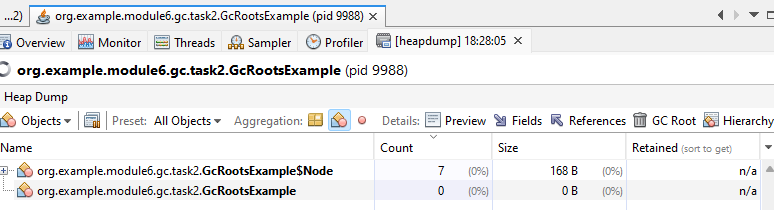
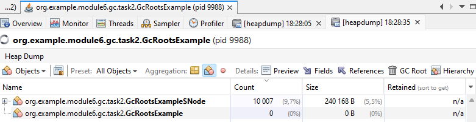
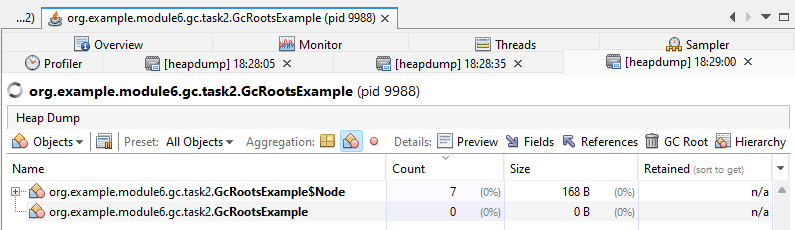

Дамп памяти после создания дерева

1. Создаем дерево объектов, в куче появляется 7 объектов-вершин дерева

2. Создаем много висячих вершин. В куче теперь 10007 объектов

3. Удаляем ссылку на висячие вершины, они удаляются. А 7 вершин дерева остаются, потому что они достижимы через GC root - корень дерева

